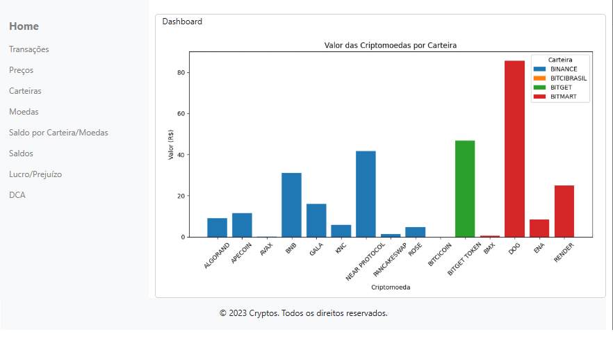
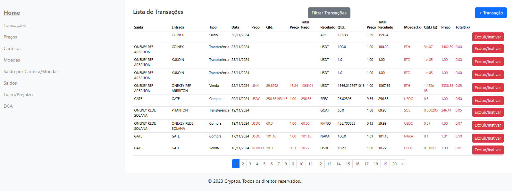
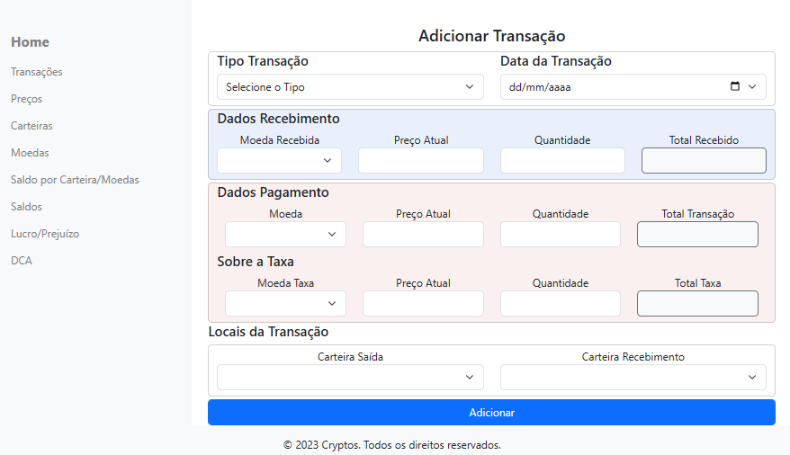
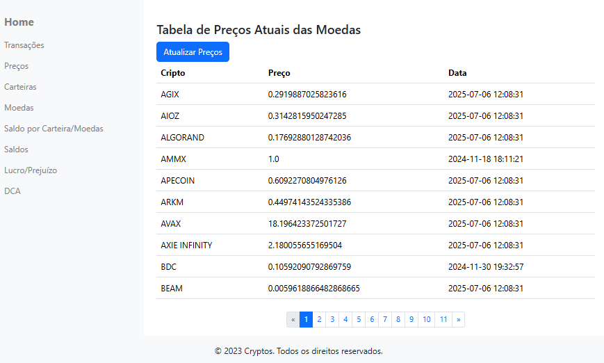
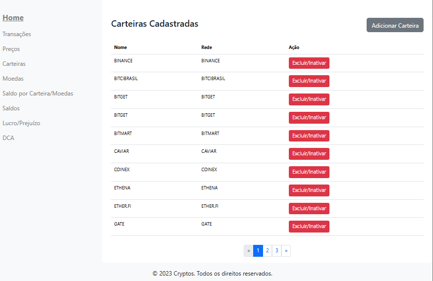
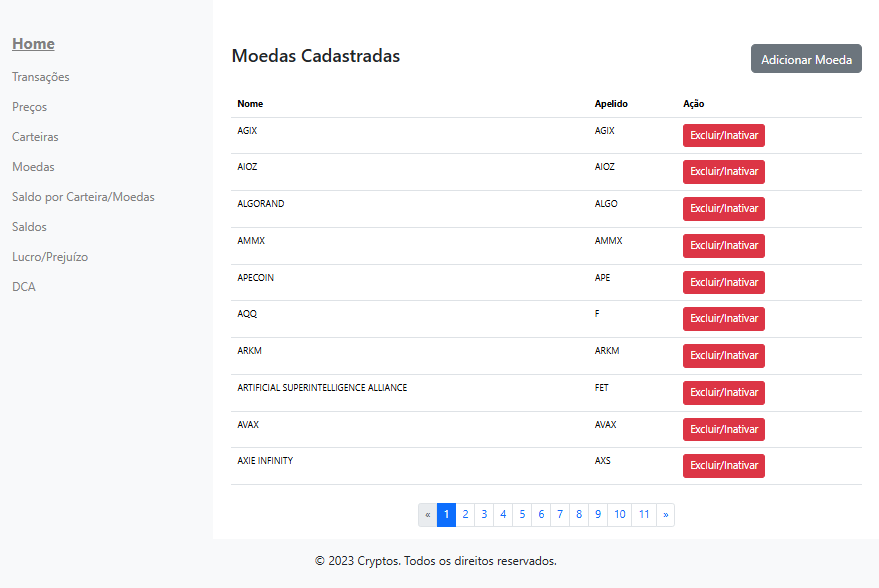
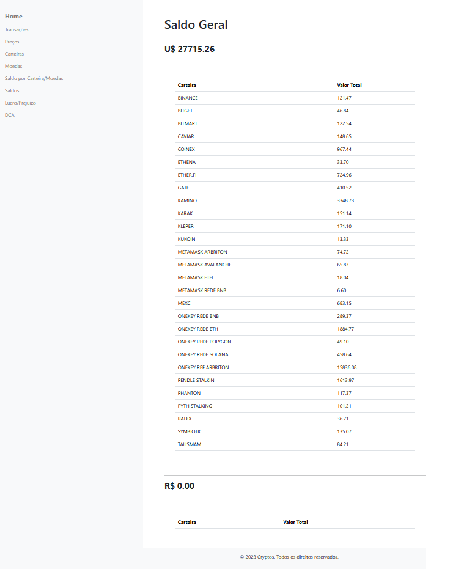
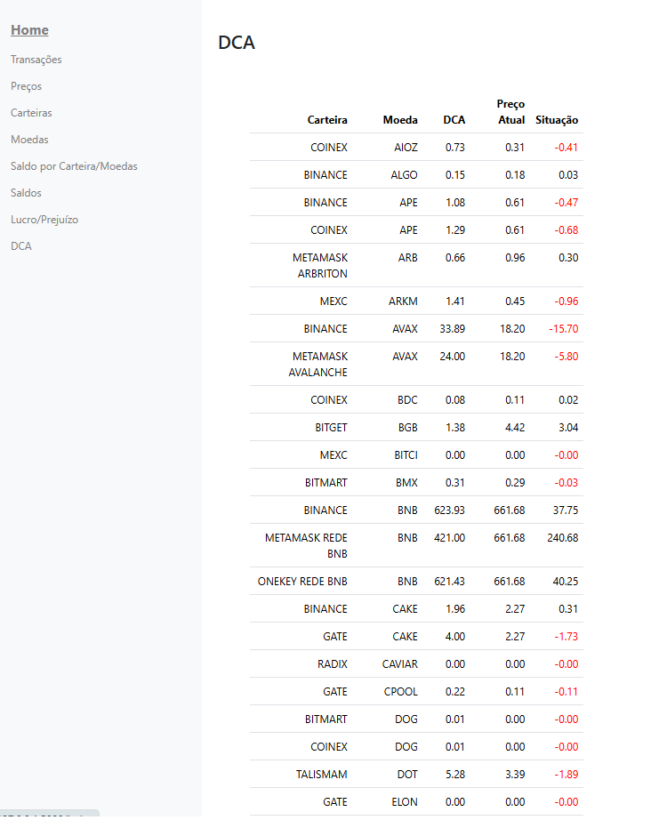

# ControleCriptos 📈

*Um gerenciador de portfólio de criptomoedas, desenvolvido em Python, para acompanhar seus investimentos em tempo real.*

[](https://github.com/psf/black)
[](https://opensource.org/licenses/MIT)

## 📖 Sobre o Projeto

O **ControleCriptos** foi desenvolvido como uma ferramenta para simplificar o acompanhamento de um portfólio de criptomoedas. A aplicação consome a API da CoinMarketCap para obter cotações atualizadas e permite ao usuário registrar, visualizar, editar e deletar suas transações, calculando automaticamente o valor total investido e o saldo atual.

## ✨ Features

- [X] **Adicionar** novas criptomoedas ao portfólio.
- [X] **Visualizar** todas as criptos em uma tabela clara e organizada.
- [X] **Atualizar** a quantidade ou valor investido de uma cripto existente.
- [X] **Deletar** criptos do portfólio.
- [X] **Cotação em Tempo Real:** Busca automática de preços via API da CoinGecko.
- [X] **Cálculo de Saldo:** Exibe o total investido, o saldo atual e o lucro/prejuízo.
- [X] DCA: Exibe o cálculo do DCA por criptomoeda.

## 🛠️ Stack Tecnológica

* Python 3.11

- Flask
- SQLAlchemy
- Bootstrap
- SQLite
- Requests (API de preços)

## 🛡️ Segurança

- Utilização de ambiente virtual
- Proteção básica de rotas
- Validação de dados de entrada

## 🚀 Como Executar

Para executar o projeto localmente, siga os passos abaixo:

**1. Clone o repositório:**

```bash
git clone https://github.com/CatiusciScheffer/ControleCriptos.git
cd ControleCriptos
```

**2. Crie e ative um ambiente virtual (Recomendado):**

```bash
# Windows
python -m venv venv
.\venv\Scripts\activate

# Linux / macOS
python3 -m venv venv
source venv/bin/activate
```

**3. Instale as dependências:**

```bash
pip install -r requirements.txt
```

**4. Execute a aplicação:**

```bash
python main.py
```

## 📷 Screenshots

- Home

  
- Transações

  

  
- Preços

  
- Carteiras

  
- Moedas

  
- Saldo por Carteira/Moedas

  
- DCA

  

## 🗂️ **Estrutura do Projeto**

```plaintext
CRYPTOS_FLASK/
├── criptoControl/  
│   ├── routes/  
│   │   ├── __init__.py  
│   │   ├── auth_routes.py  
│   │   ├── crud_crypto_wallet.py  
│   │   ├── main_routes.py  
│   │   ├── transactions_routes.py  
│   │   ├── update_price.py  
│   │   └── views_databases.py  
│   ├── static/  
│   │   ├── css/  
│   │   │   └── style.css  
│   │   ├── js/  
│   │   │   ├── scripts_consultaTransacoes.js  
│   │   │   └── scripts_transacoes.js  
│   ├── templates/  
│   │   ├── auth/  
│   │   │   ├── login.html  
│   │   │   └── register.html  
│   │   ├── operacoes/  
│   │   │   ├── add_crypto.html  
│   │   │   ├── add_transactions.html  
│   │   │   ├── add_wallet.html  
│   │   │   ├── cryptos.html  
│   │   │   ├── modal_confirm_delete.html  
│   │   │   ├── transactions.html  
│   │   │   └── wallets.html  
│   │   ├── views_databases/  
│   │   │   ├── crypto_DCA.html  
│   │   │   ├── crypto_lucroXprejuizo.html  
│   │   │   ├── filtros_transacoes.html  
│   │   │   ├── prices.html  
│   │   │   ├── transacoes_filtradas.html  
│   │   │   ├── wallet_balances.html  
│   │   │   └── wallet_summary.html  
│   │   ├── index.html  
│   │   └── navibar.html  
│   ├── __init__.py  
│   ├── api.py  
│   ├── forms.py  
│   └── models.py  
├── env/  
├── instance/  
│   └── crypto_data.db  
├── main.py  
└── requirements.txt  
```

## 📬 **Contato**

E-mail: cpcscheffer@outlook.com

Fone: 51 98127-9781

LinkedIn: https://www.linkedin.com/in/catiuscipagnonceli-cienciasdacomputacao/
