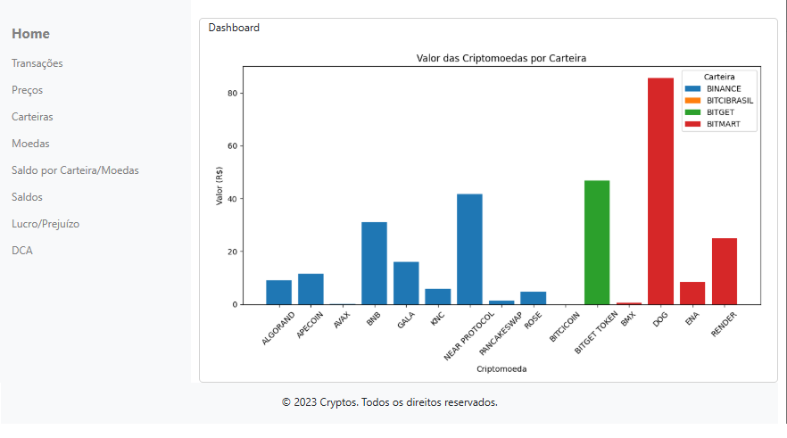
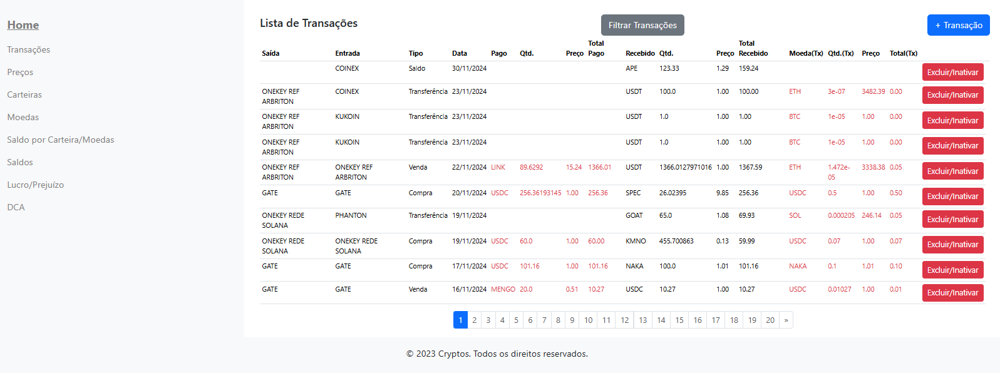
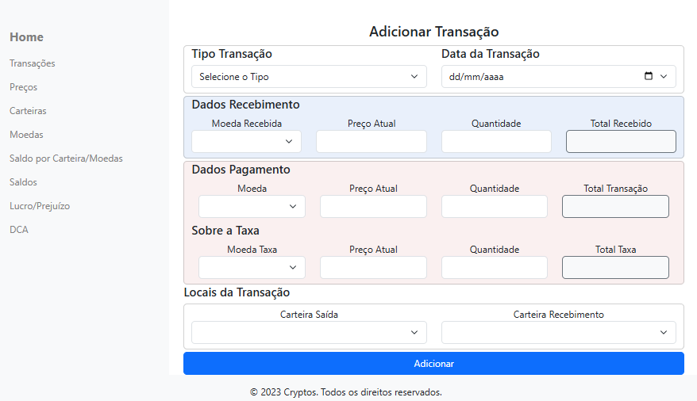
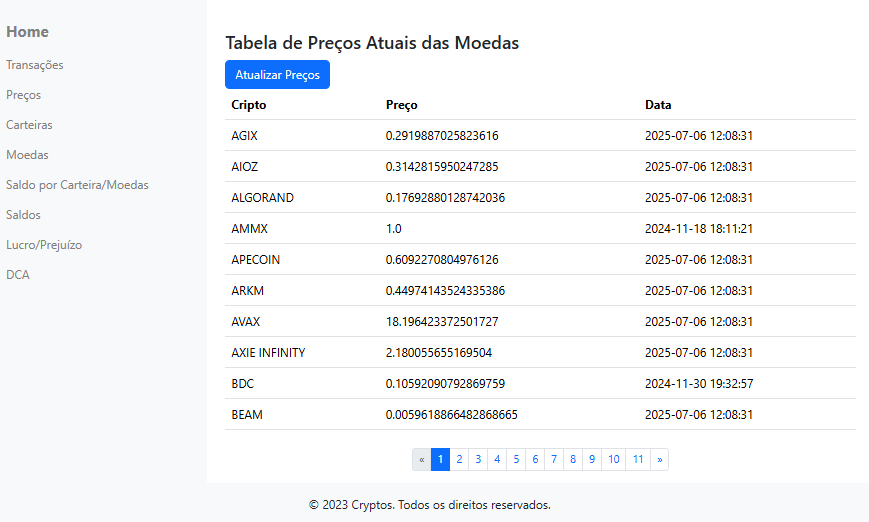
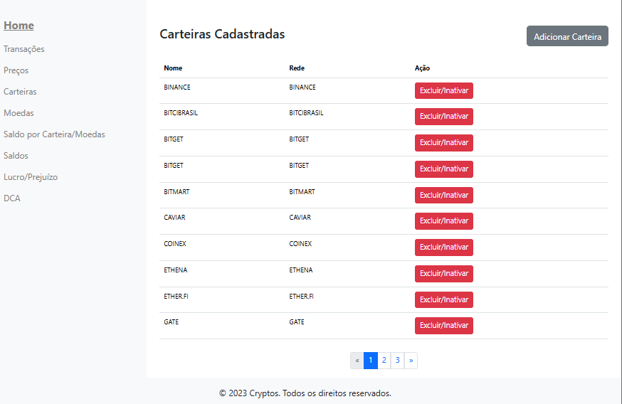
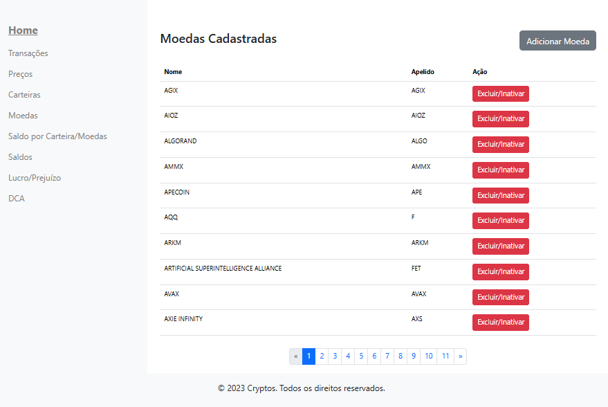
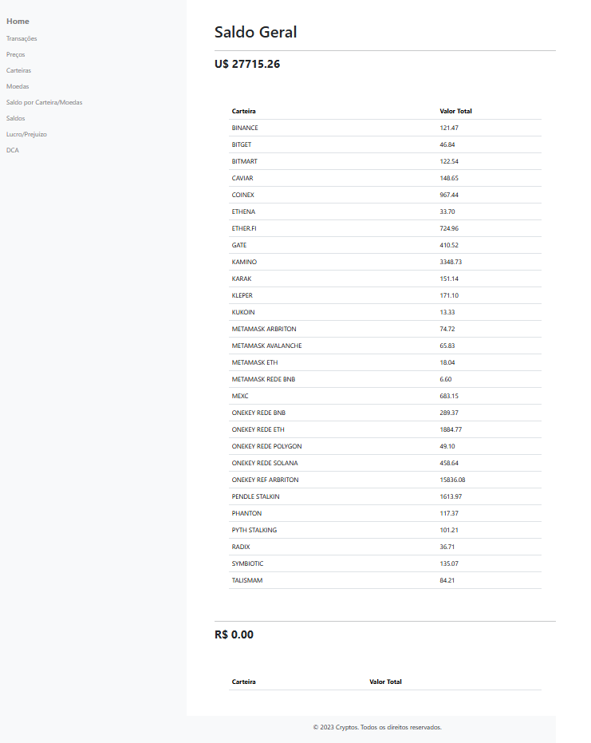
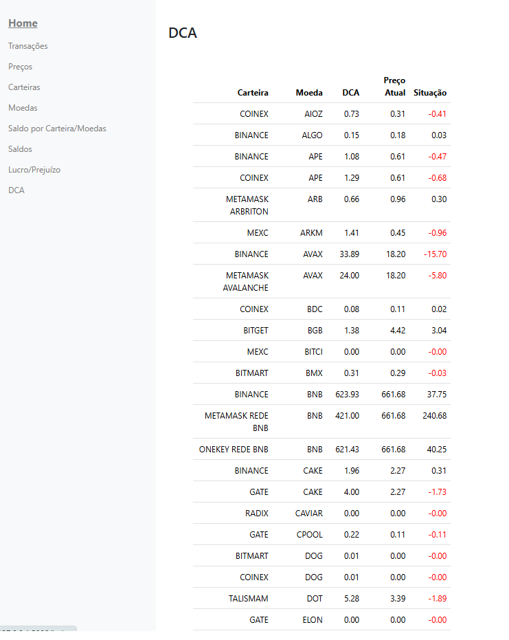

<div align="center">
  <h1>📊 Python Flask Crypto Portfolio Manager</h1>
  <p>Um gerenciador pessoal de criptomoedas para acompanhar carteira, transações e valor de mercado em tempo real.</p>
  <p>
    <!-- Badges -->
    <a href="https://github.com/CatiusciScheffer/ControleCriptos/stargazers">
      
    </a>
    
    
    
  </p>
</div>

## 🔎 Keywords

python flask crypto portfolio
cryptocurrency portfolio tracker
python web application
financial dashboard
investment tracker
crypto investment management
flask backend project
fullstack python project
api integration python
sqlite sqlalchemy flask

## 📌 Sumário

- [Sobre](#sobre)
- [Funcionalidades](#funcionalidades)
- [Tech Stack](#tech-stack)
- [Instalação](#instalação)
- [Uso](#uso)
- [Screenshots](#screenshots)
- [O que aprendi](#o-que-aprendi)
- [Contato](#contato)

## 📖 Sobre o Projeto

Este projeto foi criado para facilitar o acompanhamento de um portfólio de criptomoedas de forma simples e interativa. Ele consome dados de mercado em tempo real e ajuda o usuário a entender o desempenho dos seus investimentos.

> Projeto desenvolvido como parte do meu portfólio profissional, com foco em desenvolvimento backend, integração de APIs e boas práticas de engenharia de software.

## ✨ Funcionalidades

- [X] **Adicionar** novas criptomoedas ao portfólio.
- [X] **Visualizar** todas as criptos em uma tabela clara e organizada.
- [X] **Atualizar** a quantidade ou valor investido de uma cripto existente.
- [X] **Deletar** criptos do portfólio.
- [X] **Cotação em Tempo Real:** Busca automática de preços via API da CoinGecko.
- [X] **Cálculo de Saldo:** Exibe o total investido, o saldo atual e o lucro/prejuízo.
- [X] DCA: Exibe o cálculo do DCA por criptomoeda.

## 🧠 O que este projeto demonstra

Este projeto demonstra **experiência prática em desenvolvimento backend e full stack com Python e Flask**, indo além de exemplos acadêmicos ou tutoriais básicos.

O foco está na **construção de uma aplicação real**, com regras de negócio, integração com APIs externas e organização de código voltada à manutenibilidade e escalabilidade.

### 🧪 Como este projeto pode ser avaliado por recrutadores

Este repositório pode ser avaliado considerando os seguintes critérios técnicos e de engenharia de software:

**-  Estrutura e Organização**

- Clareza na separação de responsabilidades entre rotas, modelos e lógica de negócio
- Organização de pastas e arquivos seguindo boas práticas de aplicações Flask
- Facilidade de leitura e navegação pelo código

**- Qualidade do Código**

- Uso consistente da linguagem Python
- Código legível, padronizado e de fácil manutenção
- Implementação clara das regras de negócio

**- Integração com APIs**

- Consumo de API externa para obtenção de dados de criptomoedas
- Tratamento e adaptação dos dados externos para uso interno na aplicação

**- Lógica de Negócio**

- Modelagem do domínio (carteiras, transações, criptomoedas)
- Cálculo de saldo, lucro/prejuízo e DCA
- Controle do fluxo de dados entre backend, banco de dados e interface

**- Potencial de Evolução**

- Projeto estruturado para receber novas funcionalidades
- Possibilidade de inclusão de autenticação, testes automatizados e deploy
- Base sólida para evolução para um sistema de produção

### 💻 Competências Técnicas

- Desenvolvimento de **aplicação web com Flask**
- Implementação de **CRUD completo** utilizando **SQLAlchemy** e **SQLite**
- Integração com **APIs externas** para obtenção de dados de mercado de criptomoedas
- Implementação de **regras de negócio**, como:
  - controle de portfólio
  - cálculo de lucro/prejuízo
  - acompanhamento de investimentos
- Estruturação de interface web responsiva com **Bootstrap**
- Gerenciamento de dependências e ambiente virtual com **venv**
- Tratamento básico de erros e validações de dados

### 🧱 Boas Práticas de Engenharia de Software

- Separação de responsabilidades entre **rotas, modelos e lógica de negócio**
- Organização do projeto visando **facilidade de manutenção**
- Escrita de código legível e padronizado
- Uso de **Git e GitHub** para versionamento
- Documentação clara para facilitar entendimento e colaboração

### 🧩 Capacidade de Análise e Resolução de Problemas

- Tradução de um problema real (controle de investimentos em criptomoedas) em uma solução técnica
- Tomada de decisões sobre estrutura de dados e fluxo da aplicação
- Adaptação de dados externos (API) para uso interno no sistema

### 🚀 Evolução e Próximos Passos

- Implementação de testes automatizados
- Criação de autenticação de usuários
- Deploy da aplicação em ambiente de produção
- Melhoria na visualização dos dados (gráficos e dashboards)

## 🛠️  Tecnológicas e Ferramentas utilizadas

- **Python 3.11**
- **Flask** — framework web backend
- **SQLAlchemy** — ORM para acesso ao banco de dados
- **SQLite** — banco de dados relacional
- **Bootstrap** — estilização e layout responsivo
- **Requests** — consumo de APIs externas

## 🛡️ Segurança

- Utilização de ambiente virtual
- Estrutura preparada para proteção de rotas e autenticação
- Validação de dados de entrada

## 🚀 Como Executar

Para executar o projeto localmente, siga os passos abaixo:

**1. Clone o repositório:**

```bash
git clone https://github.com/CatiusciScheffer/ControleCriptos.git
cd ControleCriptos
```

**2. Crie e ative um ambiente virtual (Recomendado):**

```bash
# Windows
python -m venv venv
.\venv\Scripts\activate

# Linux / macOS
python3 -m venv venv
source venv/bin/activate
```

**3. Instale as dependências:**

```bash
pip install -r requirements.txt
```

**4. Execute a aplicação:**

```bash
python main.py
```

## 📷 Imagens

- Home

  
- Transações

  

  
- Preços

  
- Carteiras

  
- Moedas

  
- Saldo por Carteira/Moedas

  
- DCA

  

## 🗂️ **Estrutura do Projeto**

```plaintext
CRYPTOS_FLASK/
├── criptoControl/  
│   ├── routes/  
│   │   ├── __init__.py  
│   │   ├── auth_routes.py  
│   │   ├── crud_crypto_wallet.py  
│   │   ├── main_routes.py  
│   │   ├── transactions_routes.py  
│   │   ├── update_price.py  
│   │   └── views_databases.py  
│   ├── static/  
│   │   ├── css/  
│   │   │   └── style.css  
│   │   ├── js/  
│   │   │   ├── scripts_consultaTransacoes.js  
│   │   │   └── scripts_transacoes.js  
│   ├── templates/  
│   │   ├── auth/  
│   │   │   ├── login.html  
│   │   │   └── register.html  
│   │   ├── operacoes/  
│   │   │   ├── add_crypto.html  
│   │   │   ├── add_transactions.html  
│   │   │   ├── add_wallet.html  
│   │   │   ├── cryptos.html  
│   │   │   ├── modal_confirm_delete.html  
│   │   │   ├── transactions.html  
│   │   │   └── wallets.html  
│   │   ├── views_databases/  
│   │   │   ├── crypto_DCA.html  
│   │   │   ├── crypto_lucroXprejuizo.html  
│   │   │   ├── filtros_transacoes.html  
│   │   │   ├── prices.html  
│   │   │   ├── transacoes_filtradas.html  
│   │   │   ├── wallet_balances.html  
│   │   │   └── wallet_summary.html  
│   │   ├── index.html  
│   │   └── navibar.html  
│   ├── __init__.py  
│   ├── api.py  
│   ├── forms.py  
│   └── models.py  
├── env/  
├── instance/  
│   └── crypto_data.db  
├── main.py  
└── requirements.txt  
```

## 📬 **Contato**

E-mail: cpcscheffer@outlook.com

Fone: 51 98127-9781

LinkedIn: https://www.linkedin.com/in/catiuscipagnonceli-cienciasdacomputacao/
